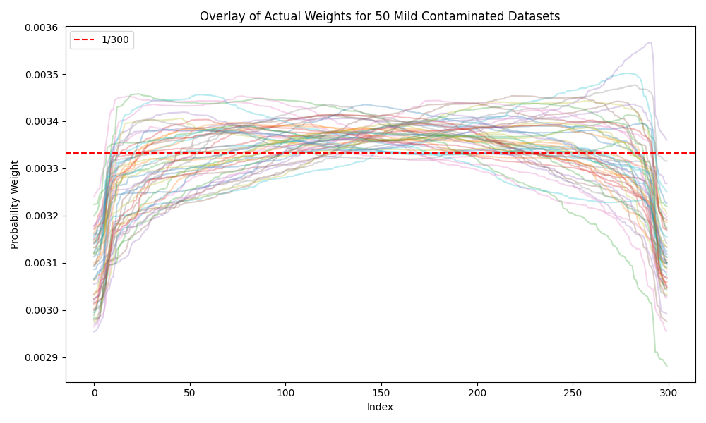

# Wasserstein Constrained Empirical Likelihood (wcETEL)

## Overview

This repository implements the Wasserstein-constrained exponentially tilted empirical likelihood (wcETEL) method, following:

> Chakraborty, A., Bhattacharya, A., & Pati, D. (2023). Robust probabilistic inference via a constrained transport metric. *arXiv preprint arXiv:2303.10085*.

The wcETEL method performs robust inference by combining:
- Empirical likelihood (EL)
- Wasserstein distance constraints

The Wasserstein penalty allows downweighting of contaminated data points and makes inference more robust under model misspecification.

This repository provides fully reproducible code for simulating datasets, computing wcETEL weights, and visualizing the results under various contamination levels.


---


## Method Summary

The wcETEL method solves the following optimization problem:

**w̃(θ) = argmin₍w₎ { D(Qw ∥ Pₙ) + λ W₂²(Qw, Fθ) }**

- $Q_w$ is a discrete distribution over the observed data points.
- $P_n$ is the empirical distribution.
- The Wasserstein distance $W_2$ is computed using semi-discrete optimal transport with power diagrams.

The iterative procedure updates weights using a fixed-point algorithm that combines empirical likelihood and optimal transport.


---


## Repository Structure

| File | Description |
|------|-------------|
| `data_generator.py` | Generate simulated datasets under different contamination settings |
| `run_wcETEL_analysis_module.py` | Implements wcETEL iterative weight updates using semi-discrete optimal transport |
| `optimal_transport_1d.py` | Power diagram & semi-discrete OT computations |
| `parallel_runner.py` | Parallel execution of wcETEL weight computation across datasets |
| `scripts/run_clean_mild_heavy.py` | Automates generating datasets and running analysis for all 3 settings |
| `scripts/plot_weights_overlay.py` | Generate overlay plots of weights for each contamination setting |
| `wcETEL_results/` | Stores output weights and intermediate results |
| `plots/` | Stores generated weight overlay plots for clean, mild, and heavy contamination |


---


## Step-by-Step Pipeline

This section explains exactly how to reproduce all results from scratch.

### 1. Generate 50 datasets

Datasets are generated under 3 contamination settings: clean, mild, heavy.
We simulate 50 datasets for each of three contamination settings:

| Setting | Main signal | Contamination |
|---------|--------------|----------------|
| Clean   | 300 samples from Beta(2,2) | None |
| Mild    | 300 samples, with 14 contaminated points (7 Beta(1,100) and 7 Beta(100,1)) | Mild contamination |
| Heavy   | 300 samples, with 60 contaminated points (30 Beta(1,100) and 30 Beta(100,1)) | Heavy contamination |

The dataset generator is located in `data_generator.py`:

```python
def generate_datasets(mode="heavy", N=300, n_datasets=50):
    datasets = []
    for i in range(n_datasets):
        np.random.seed(1000 + i)
        if mode == "clean":
            sig = np.random.beta(2, 2, size=N)
            X = np.sort(sig)
        elif mode == "mild":
            sig = np.random.beta(2, 2, size=N - 14)
            noi_1 = np.random.beta(1, 100, size=7)
            noi_2 = np.random.beta(100, 1, size=7)
            X = np.sort(np.concatenate([sig, noi_1, noi_2]))
        elif mode == "heavy":
            sig = np.random.beta(2, 2, size=N - 60)
            noi_1 = np.random.beta(1, 100, size=30)
            noi_2 = np.random.beta(100, 1, size=30)
            X = np.sort(np.concatenate([sig, noi_1, noi_2]))
        datasets.append(X)
    return datasets
```

### 2. Compute wcETEL weights

The weight computations are fully parallelized using parallel_runner.py.

```python
mode = sys.argv[1]
datasets = generate_datasets(mode)
output_dir = f"wcETEL_results/{mode}"
os.makedirs(output_dir, exist_ok=True)

def run_and_save(index_X):
    index, X = index_X
    print(f"Running dataset: {index}")
    weights, masses1 = run_wcETEL_analysis(X)
    with open(f"{output_dir}/dataset_{index}_weights.pkl", "wb") as f:
        pickle.dump({"weights": weights, "masses1": masses1}, f)

if __name__ == "__main__":
    data_list = list(enumerate(datasets))
    max_workers = min(4, multiprocessing.cpu_count())
    with ProcessPoolExecutor(max_workers=max_workers) as executor:
        executor.map(run_and_save, data_list)
```

We can execute all three contamination levels via:

```
python scripts/run_clean_mild_heavy.py
```
Or we can run individual modes:

```
python parallel_runner.py clean
```
```
python parallel_runner.py mild
```
```
python parallel_runner.py heavy
```

Results will be stored in the wcETEL_results/ folder.

### 3. Generate weight overlay plots

After all computations are completed, generate plots:

```
python scripts/plot_weights_overlay.py
```

This will generate 3 overlay plots under the plots/ folder.

Heavy contamination example:


Mild contamination example:



Clean contamination example:


### The entire pipeline can be run directly from the `parallel.ipynb` notebook.

The notebook will:
- Launch 3 contamination settings in parallel.
- Compute wcETEL weights using `parallel_runner.py`.
- Generate and save all weight overlay plots.
- Display all plots directly inside the notebook.


